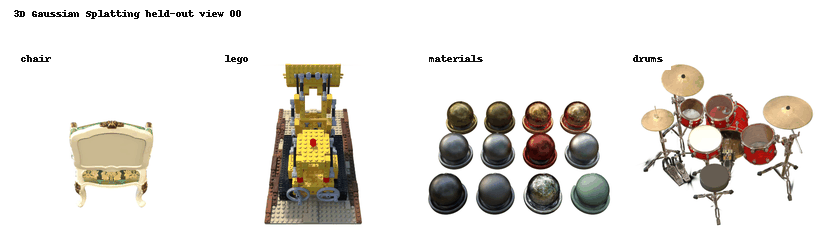
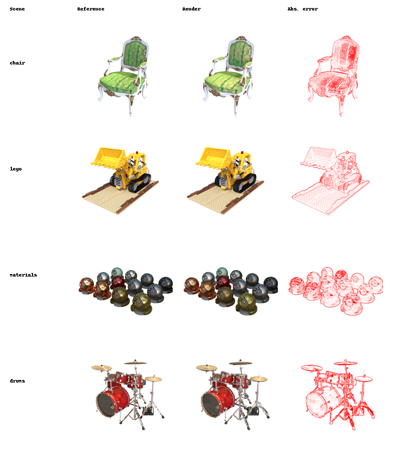
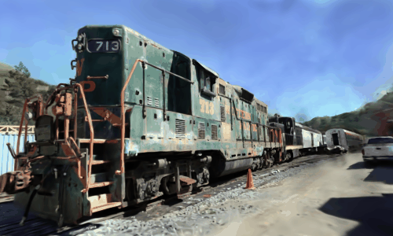

# 3D Gaussian Splatting Renderer

## Abstract

Novel view synthesis requires a scene representation that is geometrically meaningful, photometrically expressive, and efficient to render. This project studies 3D Gaussian Splatting as an explicit radiance field representation for four Blender synthetic scenes: `chair`, `lego`, `materials`, and `drums`. Instead of reconstructing a mesh or querying a neural field for every pixel, the scene is represented as a collection of anisotropic 3D Gaussians. Each Gaussian stores a center, covariance, opacity, and spherical-harmonic color coefficients, allowing it to encode local shape and view-dependent appearance.

The renderer projects these 3D Gaussians into each calibrated test camera view, transforms their world-space covariances into image-plane ellipses, and evaluates their contribution to nearby pixels with a Gaussian falloff. Visible splats are depth-sorted and alpha-composited tile by tile, producing dense images from a sparse Gaussian cloud while preserving soft silhouettes and subpixel coverage. This covariance-aware splatting is the key advantage over naive point projection: each point becomes a smooth footprint whose size, orientation, opacity, and color are tied to camera geometry.


## Output Gallery

### Four-Scene Render Sweep



The animation shows all four scenes in one synchronized panel as the final renderer sweeps through held-out test camera views. Each frame is rendered from the optimized Gaussian splat cloud and saved under `outputs/renders/<scene>/`.

### Reference, Render, and Error Panel



The static panel compares one representative held-out view per scene. The reference image is composited over a white background and resized from `800x800` to the renderer's `400x400` output resolution because `src/constants.py` sets `USE_HALF = True`. The error column is an amplified absolute RGB difference map, so redder areas mark larger mismatch.

### Real-World Calibrated Render



This animation renders a real `train` scene from the [camenduru mirror of the official Gaussian Splatting assets](https://huggingface.co/camenduru/gaussian-splatting). Unlike an orbit around an unposed PLY file, this run uses the model's calibrated `cameras.json` camera centers, rotations, and focal lengths with the trained `point_cloud.ply`.

## Setup

From the project root:

```bash
cd /mntdatalora/src/3D-Gaussian-Splatting
python -m pip install -r requirements.txt
```

The optional CUDA extension in `sub-modules/simple-knn` can be built with:

```bash
bash execution_scripts/setup_env.sh
```

The renderer in this repository does not import `simple-knn`, so rendering can still run when the CUDA extension is not installed.

## Data Layout

Expected files:

```text
data/
  chair.ply
  lego.ply
  materials.ply
  drums.ply
  nerf_synthetic/
    chair/transforms_test.json
    lego/transforms_test.json
    materials/transforms_test.json
    drums/transforms_test.json
```

Each `transforms_test.json` file stores 100 held-out camera poses. Each scene directory also contains RGBA reference images under `test/`.

Optional calibrated real-scene files:

```text
external_datasets/
  camenduru_gaussian_splatting/
    train/
      cameras.json
      point_cloud/iteration_7000/point_cloud.ply
```

## Execution

Render all assignment scenes:

```bash
bash execution_scripts/render_all.sh
```

Run the config-driven pipeline:

```bash
bash execution_scripts/run_with_config.sh configs/full_run.yml
```

Render a single scene:

```bash
python utils/render.py --scene-type lego --device-type cuda --out-root outputs/renders
```

Render the calibrated real-world train scene:

```bash
python utils/render_real_cameras.py \
  --num-views 12 \
  --stride 25 \
  --max-width 500 \
  --device-type cuda \
  --out-dir outputs/real_renders/camenduru_train
```

Evaluate rendered outputs with the dependency-backed evaluator:

```bash
python evaluation/evaluate.py \
  --ref-root data/nerf_synthetic \
  --out-root outputs/renders \
  --output-file outputs/evaluation/evaluation.txt \
  --scenes chair lego materials drums
```

## Stage 1: Camera and Gaussian Scene Loading

### Model

Each scene is loaded from a binary PLY file. For every Gaussian splat, the loader reads:

- 3D mean position `mu`
- opacity `alpha`
- anisotropic scale vector `s`
- quaternion rotation `q`
- spherical-harmonic color coefficients

The renderer converts the stored parameters into active values:

```math
\alpha = \sigma(\alpha_{\text{raw}}),
\qquad
s = \exp(s_{\text{raw}}),
\qquad
q = \frac{q_{\text{raw}}}{\|q_{\text{raw}}\|}.
```

The 3D covariance is built from scale and rotation:

```math
L = R(q)\,\operatorname{diag}(s),
\qquad
\Sigma_{3D} = L L^\top.
```

This covariance is what turns a point into an oriented volumetric Gaussian. Large scale values make wide splats, small scale values make sharp splats, and the quaternion rotates the ellipsoid in 3D.

### Implementation

- Scene loader: `utils/render.py`
- Scene data class: `src/scene.py`
- Camera data class: `src/camera.py`
- Covariance construction: `src/renderer.py`

## Stage 2: World-to-NDC Projection

### Model

The Gaussian center starts in world coordinates:

```math
p_w =
\begin{bmatrix}
x & y & z & 1
\end{bmatrix}.
```

It is transformed into camera/view space using the world-to-camera matrix:

```math
p_v = p_w V.
```

Then it is transformed into clip space:

```math
p_c = p_v P.
```

Normalized device coordinates are obtained by homogeneous division:

```math
p_{\text{ndc}} =
\frac{p_c}{p_{c,w}}.
```

Only points in front of the near plane are retained:

```math
p_{v,z} > z_{\text{near}}.
```

Finally, NDC coordinates are converted into pixel coordinates:

```math
u = \frac{(x_{\text{ndc}} + 1)W - 1}{2},
\qquad
v = \frac{(y_{\text{ndc}} + 1)H - 1}{2}.
```

### Interpretation

This stage decides where every Gaussian center lands on the image plane. Without this projection, the renderer would only know where splats live in 3D, not which pixels they can affect.

## Stage 3: Covariance Projection

### Model

A 3D Gaussian is not projected as a single pixel. Its covariance is pushed through the camera projection, producing a 2D covariance ellipse:

```math
\Sigma_{2D}
=
J W \Sigma_{3D} W^\top J^\top.
```

Here `W` is the rigid rotation part of the world-to-camera transform, and `J` is the projective Jacobian:

```math
J =
\begin{bmatrix}
\frac{f_x}{t_z} & 0 & -\frac{f_x t_x}{t_z^2} \\
0 & \frac{f_y}{t_z} & -\frac{f_y t_y}{t_z^2} \\
0 & 0 & 0
\end{bmatrix}.
```

The values `t_x`, `t_y`, and `t_z` are the Gaussian center coordinates in camera space. This Jacobian explains why splats grow when they are closer to the camera and shrink when they are farther away.

The implementation adds a small low-pass filter:

```math
\Sigma_{2D}^{+} = \Sigma_{2D} + 0.3 I.
```

This avoids needle-like ellipses that would be undersampled by the pixel grid.

### Interpretation

This stage is where 3DGS becomes visually better than a sparse point cloud renderer. A point would flicker or disappear between pixels. A projected covariance gives every Gaussian a smooth footprint, so nearby pixels receive continuous color and opacity.

## Stage 4: Tile-Based Splat Rasterization

### Model

For memory efficiency, the image is divided into square tiles. For each tile, the renderer finds Gaussians whose projected ellipses overlap that tile. The selected splats are sorted by depth.

For pixel `i` and Gaussian `j`, the displacement from the splat center is:

```math
d_{ij} = x_i - \mu_j.
```

The Gaussian image-plane weight is:

```math
w_{ij}
=
\exp\left(
-\frac{1}{2} d_{ij}^{\top}
\Sigma_{j}^{-1}
d_{ij}
\right).
```

The effective alpha at that pixel is:

```math
\tilde{\alpha}_{ij} = w_{ij}\alpha_j.
```

Front-to-back alpha compositing gives the final color:

```math
C_i = \sum_j c_j \tilde{\alpha}_{ij}
\prod_{k=1}^{j-1}(1-\tilde{\alpha}_{ik}).
```

With a white background, the remaining transmittance contributes white:

```math
C_i^{\text{final}}
=
C_i
+
\left(\prod_j (1-\tilde{\alpha}_{ij})\right)
\mathbf{1}.
```

### Interpretation

This stage explains the visual improvement. Every pixel receives a weighted mixture of all relevant nearby splats, sorted by visibility. The renderer therefore produces smooth silhouettes, soft subpixel coverage, and view-dependent color instead of jagged isolated points.

## Current Rendered Outputs

The current render folders contain complete 100-view outputs for all four assignment scenes:

| Scene | Rendered PNGs | Video | Output directory |
| --- | ---: | --- | --- |
| `chair` | 100 | yes | `outputs/renders/chair` |
| `lego` | 100 | yes | `outputs/renders/lego` |
| `materials` | 100 | yes | `outputs/renders/materials` |
| `drums` | 100 | yes | `outputs/renders/drums` |

The calibrated real-world render is stored separately:

| Scene | Rendered PNGs | GIF/video | Output directory |
| --- | ---: | --- | --- |
| `camenduru_train` | 12 | yes | `outputs/real_renders/camenduru_train` |

## Scene Statistics

| Scene | Gaussian vertices | PLY size | Test views | Render size |
| --- | ---: | ---: | ---: | --- |
| `chair` | 487,713 | 116 MB | 100 | `400x400` |
| `lego` | 322,652 | 77 MB | 100 | `400x400` |
| `materials` | 280,444 | 67 MB | 100 | `400x400` |
| `drums` | 389,357 | 93 MB | 100 | `400x400` |

External calibrated real scene:

| Scene | Gaussian vertices | PLY size | Calibrated cameras | Render size |
| --- | ---: | ---: | ---: | --- |
| `camenduru_train` | 667,872 | 166 MB | 301 | `500x300` |

## Sampled Image Metrics

The table below was computed for README reporting from five representative views per scene: `0`, `25`, `50`, `75`, and `99`. References were composited over white and resized from `800x800` to `400x400` before comparison. Full LPIPS evaluation requires the `torchmetrics[image]` dependency path used by `evaluation/evaluate.py`.

| Scene | Sampled views | PSNR dB higher is better | MAE lower is better | RMSE lower is better |
| --- | ---: | ---: | ---: | ---: |
| `chair` | 5 | 27.3700 | 0.011816 | 0.042806 |
| `lego` | 5 | 27.7823 | 0.010944 | 0.040821 |
| `materials` | 5 | 24.9514 | 0.016061 | 0.056550 |
| `drums` | 5 | 20.7825 | 0.029628 | 0.091385 |
| **sample average** | 5 per scene | **25.2216** | **0.017112** | **0.057890** |

Metric files:

- `outputs/evaluation/readme_sample_metrics.csv`
- `outputs/evaluation/readme_sample_metrics.json`
